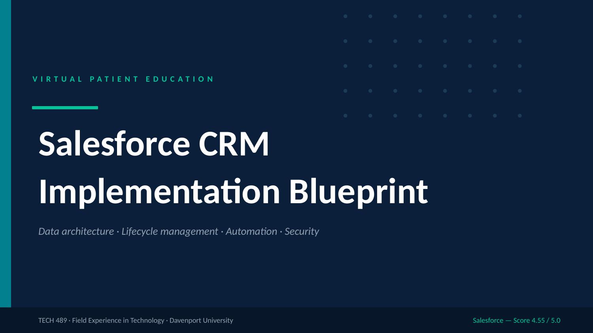
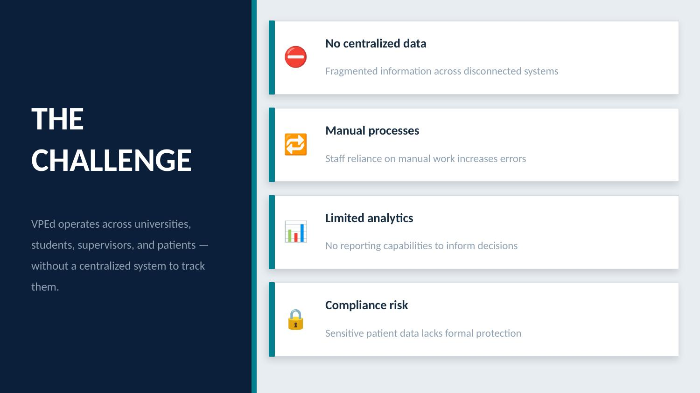
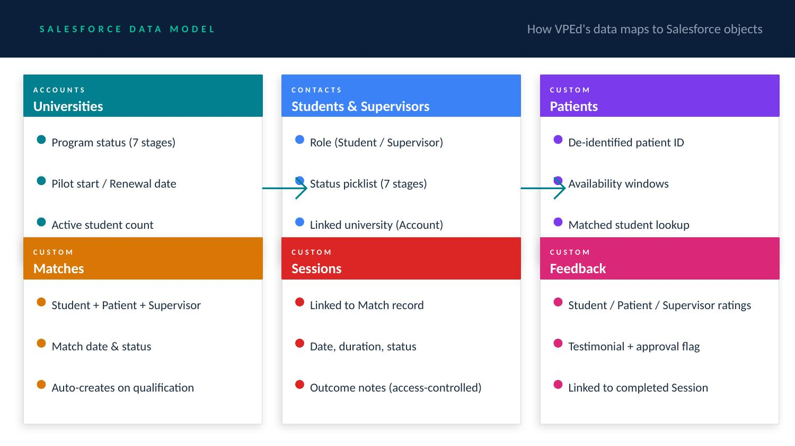
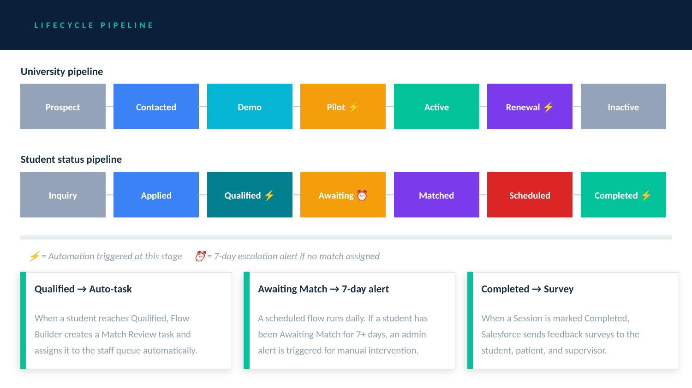
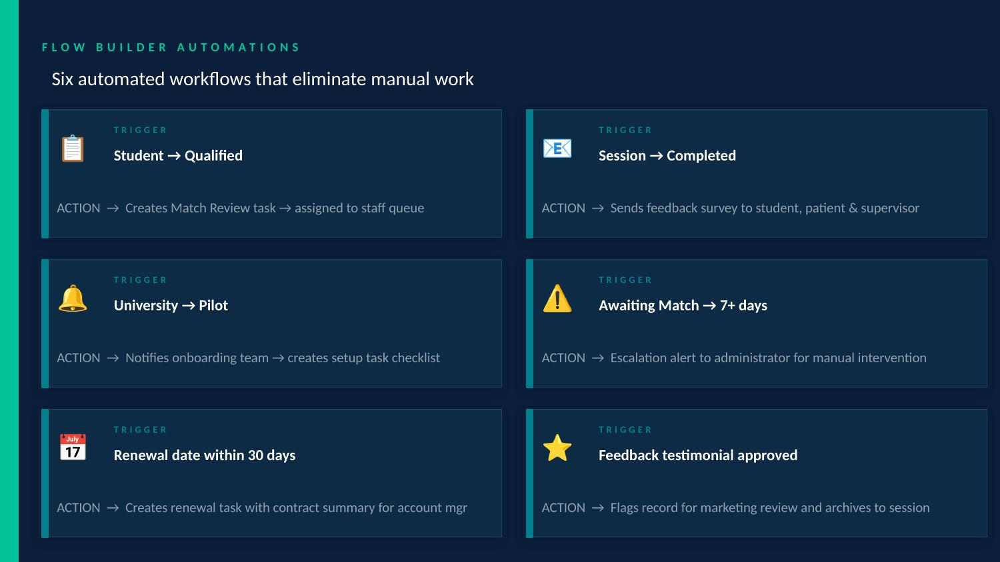
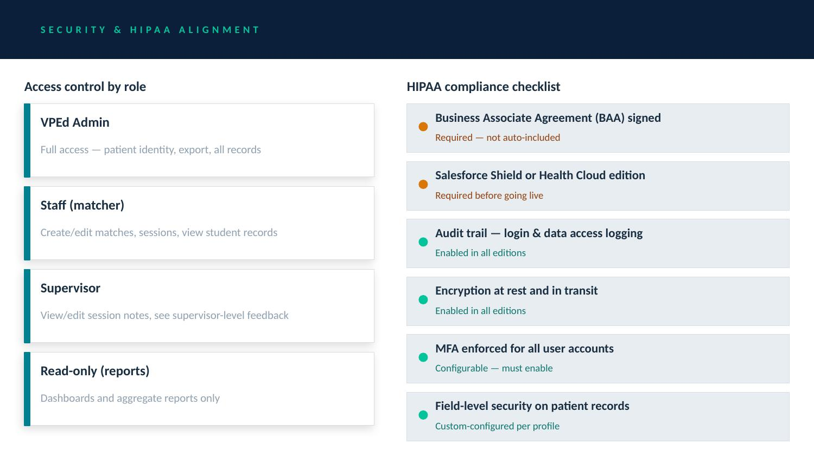
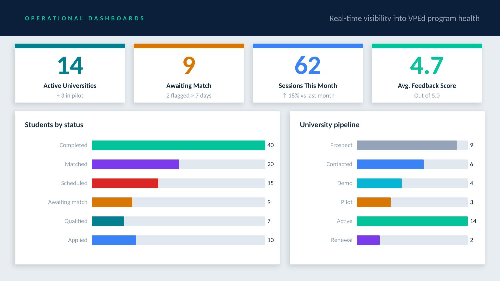
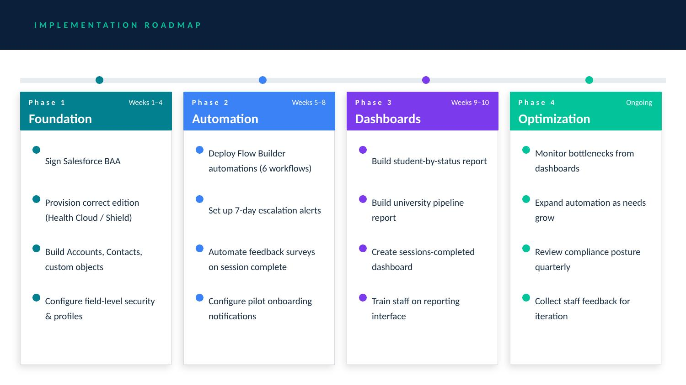
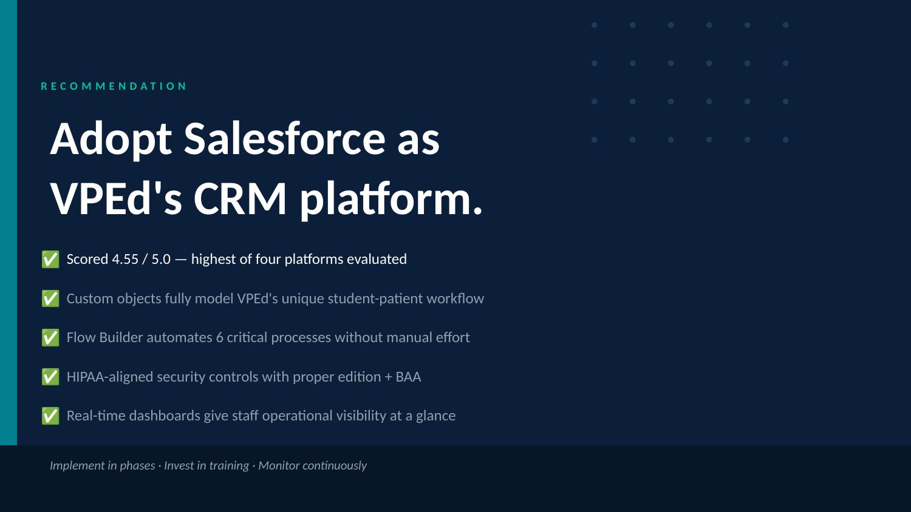

# VPEd Salesforce CRM — Implementation Blueprint

> **Virtual Patient Education (VPEd)** · TECH 489: Field Experience in Technology · Davenport University

VPEd is an organization that connects healthcare students with patients for virtual educational sessions. This repository documents the full Salesforce CRM implementation blueprint recommended to VPEd after a multi-phase consulting engagement — covering data architecture, lifecycle management, workflow automation, HIPAA-aligned security, and operational dashboards.

**Salesforce scored 4.55 / 5.0** in a weighted evaluation against Microsoft Dynamics 365, HubSpot, and Pipedrive — the highest of all platforms reviewed.

---

## Preview

| Slide | Topic |
|-------|-------|
|  | Title |
|  | The Challenge |
|  | Salesforce Data Model |
|  | Lifecycle Pipeline |
|  | Flow Builder Automations |
|  | Security & HIPAA |
|  | Operational Dashboards |
|  | Implementation Roadmap |
|  | Recommendation |

---

## Repository Structure

```
vped-salesforce-crm/
├── README.md                        # This file
├── docs/
│   ├── Written_Report.pdf           # Full written consulting report
│   ├── Salesforce_Research.pdf      # Phase 3 Salesforce research findings
│   └── data-model.md                # Salesforce object model reference
│   └── automation-flows.md          # Flow Builder automation specifications
│   └── security-hipaa.md            # Security controls and HIPAA checklist
├── assets/
│   ├── VPEd_Salesforce_CRM.pptx    # Presentation deck (Google Slides compatible)
│   └── slides/                      # Slide preview images (slide-1.jpg … slide-9.jpg)
└── src/
    └── generate-presentation.js     # PptxGenJS script that built the deck
```

---

## The Problem

VPEd lacked a centralized system for managing its complex stakeholder network:

- **No centralized data** — universities, students, supervisors, and patients tracked in silos
- **Manual processes** — staff relied on spreadsheets and email for matching and scheduling
- **No reporting** — no real-time visibility into bottlenecks, caseloads, or program capacity
- **Compliance risk** — sensitive patient data handled without formal security controls

---

## The Solution — Salesforce CRM

### Data Architecture

Six Salesforce objects map directly to VPEd's operational entities:

| Object | Type | Purpose |
|--------|------|---------|
| **Accounts** | Standard | Universities — program status, renewal dates |
| **Contacts** | Standard | Students & supervisors — status, linked university |
| **Patients** | Custom | De-identified patient records, availability, match lookup |
| **Matches** | Custom | Student ↔ Patient ↔ Supervisor relationship |
| **Sessions** | Custom | Scheduled sessions — date, duration, outcome notes |
| **Feedback** | Custom | Ratings (student / patient / supervisor), testimonials |

### Lifecycle Pipelines

**University pipeline:** Prospect → Contacted → Demo → Pilot ⚡ → Active → Renewal ⚡ → Inactive

**Student pipeline:** Inquiry → Applied → Qualified ⚡ → Awaiting match ⏰ → Matched → Scheduled → Completed ⚡

> ⚡ = automation triggered · ⏰ = 7-day escalation alert

### Flow Builder Automations (6 workflows)

| Trigger | Action |
|---------|--------|
| Student → Qualified | Create Match Review task → assign to staff queue |
| Session → Completed | Send feedback survey to student, patient & supervisor |
| University → Pilot | Notify onboarding team → create setup task checklist |
| Awaiting match → 7+ days | Escalation alert to administrator |
| Renewal date within 30 days | Create renewal task with contract summary |
| Feedback testimonial approved | Flag for marketing review, archive to session |

### Security & HIPAA Alignment

| Control | Detail |
|---------|--------|
| Profiles & permission sets | Admin / Staff / Supervisor / Read-only roles |
| Field-level security | Patient identity restricted to Admin only |
| Audit trail | Login and data access logging enabled |
| Encryption | At rest and in transit (all editions) |
| MFA | Enforced for all users |
| BAA | **Must be signed before go-live** — not auto-included |

> ⚠️ Salesforce requires a Business Associate Agreement (BAA) and the correct edition (Health Cloud or Salesforce Shield) before handling PHI.

---

## Implementation Roadmap

| Phase | Timeline | Focus |
|-------|----------|-------|
| **1 — Foundation** | Weeks 1–4 | Sign BAA, provision edition, build objects, configure security |
| **2 — Automation** | Weeks 5–8 | Deploy 6 Flow Builder workflows, set up alerts |
| **3 — Dashboards** | Weeks 9–10 | Build reports, train staff |
| **4 — Optimization** | Ongoing | Monitor, iterate, expand automation |

---

## Operational Dashboards

Real-time Salesforce dashboards provide visibility into:

- Students by status (pipeline health)
- Universities by stage (engagement tracking)
- Sessions completed per month
- Average feedback scores across all parties
- Students awaiting match for 7+ days (escalation queue)

---

## Evaluation Summary

| Platform | Score (/ 5.0) |
|----------|---------------|
| **Salesforce** ✅ | **4.55** |
| Microsoft Dynamics 365 | 4.35 |
| HubSpot | 4.25 |
| Pipedrive | 3.60 |

Evaluated across: usability, customization, automation, reporting, integrations, scalability, security, and pricing.

---

## How to Regenerate the Presentation

The slide deck was built programmatically using [PptxGenJS](https://gitbookio.github.io/pptxgenjs/).

```bash
npm install -g pptxgenjs
node src/generate-presentation.js
# Output: VPEd_Salesforce_CRM.pptx
```

---

## Documents

| File | Description |
|------|-------------|
| [`docs/Written_Report.pdf`](docs/Written_Report.pdf) | Full written consulting report — business analysis, industry review, CRM evaluation, and recommendation |
| [`docs/Salesforce_Research.pdf`](docs/Salesforce_Research.pdf) | Phase 3 research — Salesforce object structure, automation, security, and feedback systems |
| [`docs/data-model.md`](docs/data-model.md) | Detailed Salesforce data model reference |
| [`docs/automation-flows.md`](docs/automation-flows.md) | Full automation flow specifications |
| [`docs/security-hipaa.md`](docs/security-hipaa.md) | Security controls and HIPAA compliance guide |

---

## About This Project

This blueprint was developed as part of a student consulting engagement at **Davenport University** (TECH 489: Field Experience in Technology). The team conducted a mixed-methods research process — reviewing academic literature, Salesforce documentation, and healthcare CRM best practices — to deliver a phased implementation recommendation tailored to VPEd's operational needs.

---

*Davenport University · College of Technology · TECH 489*
